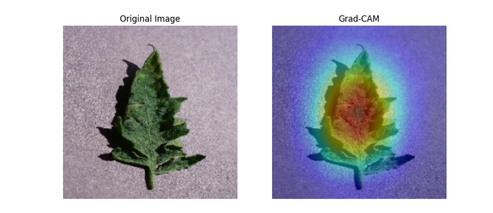
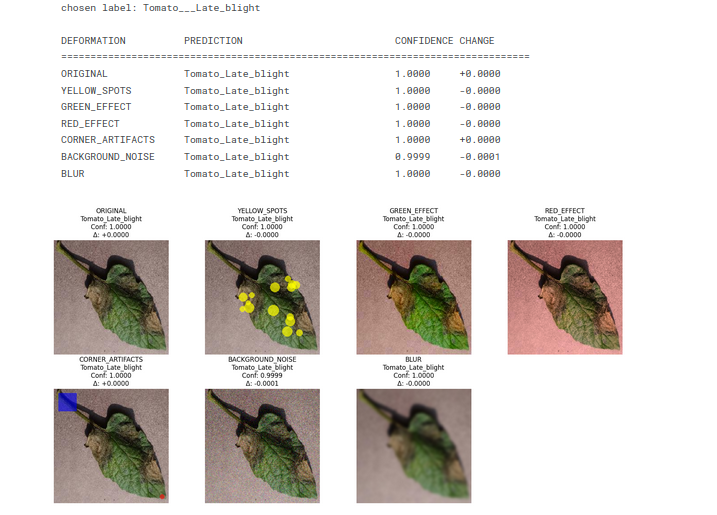
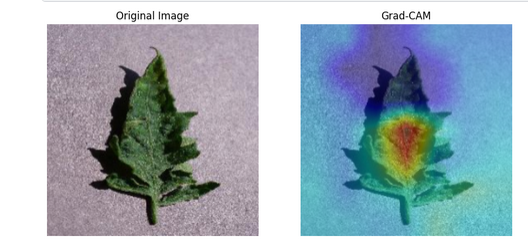
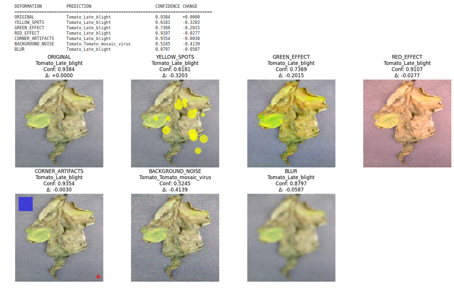
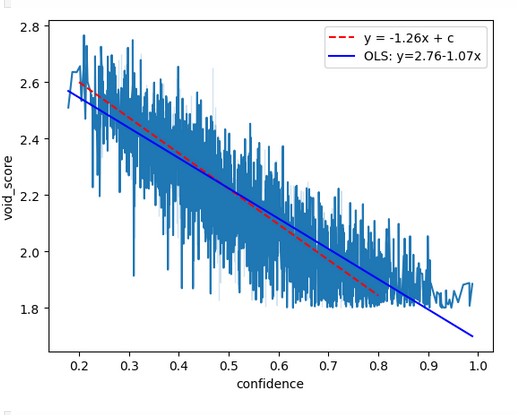
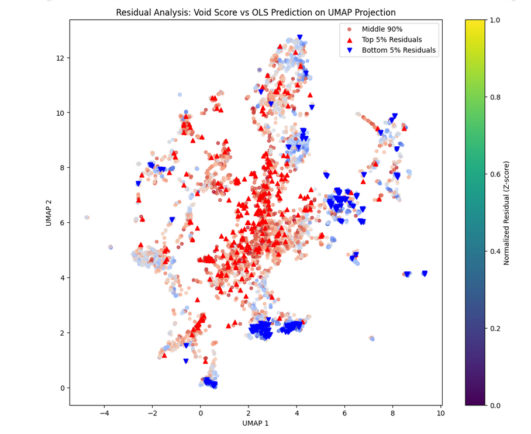
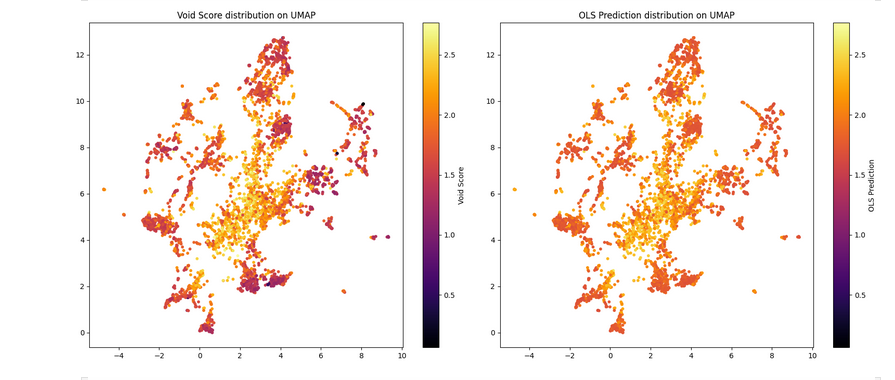
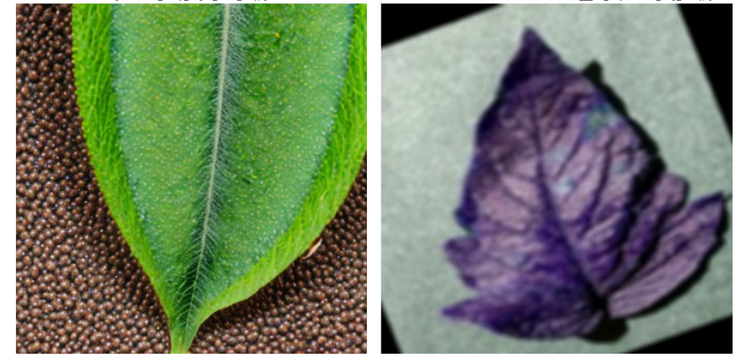
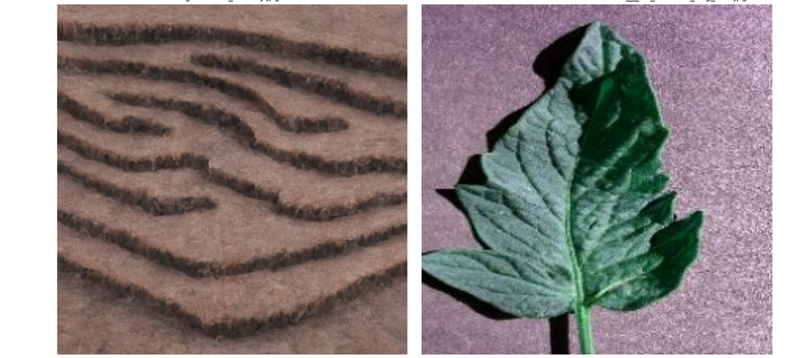
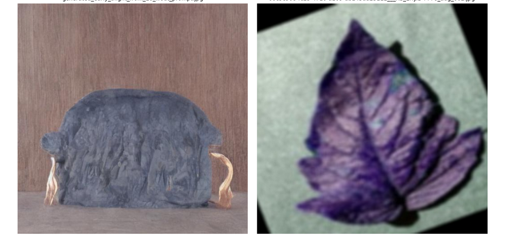

# manifold-explorer
Beyond Accuracy: A case study in building trustworthy AI by stress-testing, explaining, and optimizing a computer vision model for robust deployment on an edge device.
> - Dataset used: [here](https://www.kaggle.com/datasets/kaustubhb999/tomatoleaf)
## Core Philosophy of the Project

The purpose of this project is not to blindly chase accuracy. Our main goal is to understand the gap between a model's theoretical **"known world"** and the chaotic **"real world"** and to bridge this gap.

We define this with a mathematical objective:
* `E`: The infinite space of all possible images in the real world.
* `D`: Our clean, "studio" dataset at hand.
* `D''`: The learned space (learned manifold) that our model understands and can "comfortably navigate."

Our task is to explore the boundaries of the model's comfort zone `D''`. We aim to expand this area toward regions of `E` that were not previously covered. This means understanding and narrowing the **error manifold** **ε = E \ D''** (the area where the model doesn't know and will make mistakes).

*In short, we aim to make the model more reliable by hunting down its weaknesses.*

** Methodological Note:** The execution of this project by a single researcher carries a **natural bias risk** in Red Teaming and Chaos Testing designs. The discovered weaknesses should be interpreted with this constraint in mind.

## Initial Research: Which Model Knows How to Say "I Don't Know"? (`01_baseline_finetune.ipynb`)

Starting with this philosophy, our first task was to find a model that behaves "honestly" in the face of uncertainty. We compared two popular architectures based on this principle.

### Experiment 1: ResNet - A Dangerous Overconfidence

Our initial tests with ResNet were a vivid proof of why high accuracy rates can be misleading.
> - Full Kaggle notebook: [here](https://github.com/sinankarip/manifol-explorer/blob/main/notebooks/00_RNet_Shortcut_Learning.ipynb)  

* **Setup:** We fine-tuned the model with over 150,000 augmented images.
* **Misleading Result:** We achieved an absurdly high accuracy of **97%** on the "easy" validation set.
* **Stress Test Findings:** When the model stepped outside its comfort zone, it refused to say "I don't know."
   * It produced **absurd predictions** even with the slightest image corruptions.
   * More worryingly, it acted with **dangerous overconfidence** (99%+ confidence) while making these errors. There was almost no decrease in confidence scores.
* **Grad-CAM**: The heatmap below shows ResNet's tendency to focus on broader, less specific regions.

* **Overconfidence Analysis**: The plot clearly demonstrates ResNet's dangerous overconfidence. The confidence distribution for stress-test data (red) remains dangerously high, overlapping almost completely with the distribution for normal data (blue).

**Summary:** ResNet was an unreliable candidate, prone to making errors silently and with self-assurance.

### Experiment 2: EfficientNet - An Honest Uncertainty

EfficientNet, however, exhibited a completely different character.

* **Setup:** We applied the same training process to EfficientNet.
* **Stress Test Findings:** The model gave an honest response when faced with unfamiliar data.
   * As if saying "I haven't seen these areas, I don't know what to do," it showed **significant and consistent decreases** in confidence scores.
   * This behavior indicated that the model better understood the limits of its own knowledge.
* **Grad-CAM**: In contrast, EfficientNet focuses sharply on the relevant areas of the leaf, as shown in the heatmap.

* **Overconfidence Analysis**: This plot highlights EfficientNet's "honest uncertainty." When faced with stress-test data (red), the model's confidence distribution shifts significantly to the left, indicating it "knows what it doesn't know."

**Summary:** EfficientNet offered a more solid foundation as a model that "knows what it doesn't know" and was selected for the continuation of the project.

# 02_latent_voids.ipynb — Into the Latent Geometry of Uncertainty

## 1. Motivation: Beyond Accuracy, Toward Geometric Honesty

In our first notebook (`01_baseline_finetune.ipynb`), we compared model behaviors under epistemic stress. ResNet demonstrated pathological overconfidence, maintaining near-uniformly high softmax confidences even under strong distributional shifts. EfficientNet, by contrast, displayed what we called **honest uncertainty**—a meaningful reduction in confidence when encountering unknown inputs.

However, scalar confidence alone is a surface symptom. The deeper question is geometric:

> "What does the model's internal representation space look like when it admits, or refuses to admit, ignorance?"

To investigate this, the second stage of the study turns inward, mapping the model's learned manifold **D″**—the subset of the feature space where the network feels "comfortable." The objective is to quantify and visualize how this manifold diverges from the real-world space **E**, and to characterize the **voids**—regions of high epistemic entropy and low sample support.

## 2. Method: Constructing the Void Score

Each image in the test and validation sets was embedded through EfficientNet's penultimate layer, yielding CNN feature vectors. Three orthogonal indicators were computed for each point:

### Uncertainty Score
- **Formula**: `u_i = 1 - max_j p_ij` where `p_ij = softmax(z_i)_j`
- **Purpose**: Captures predictive entropy—how unsure the model is in label space.

### Density Score
- **Method**: Estimated by k-nearest neighbor distances

### Outlier Score
- **Method**: Computed per class via Mahalanobis distance
- **Purpose**: Approximates how far the sample lies from its class manifold

The three components were normalized and linearly combined with equal weights `w = [1, 1, 1]` to form the **Void Score V_i**.

This metric jointly encodes epistemic (model-based) and aleatoric (data-based) uncertainty in a latent geometric sense.

## 3. Latent-Space Topology via UMAP Projection

To interpret the Void Score structurally, all feature vectors were reduced to 2D using UMAP (Uniform Manifold Approximation and Projection).

**Key Findings:**
- Regions with high Void Score formed **void clusters**—low-density, high-uncertainty zones
- Compact low-Void Score regions corresponded to over-represented, "safe" manifolds where the model's behavior is stable
- Despite the small test set (N=1000), systematic augmentation confirmed that void regions correlate strongly with confidence collapses under input perturbations

## 4. Linear Proxy Analysis

A striking empirical pattern emerged: a consistent linear trend between confidence and Void Score, suggesting a simple linear relation explains much of the variance.

**OLS Model Performance:**
- MAE: 0.0889
- MAPE: 0.0419  
- RMSE: 0.1127

**Residual Interpretation:**
- **Red Triangles (▲)**: Samples where actual Void Score > predicted—truly chaotic, underrepresented areas missed by OLS
- **Blue Triangles (▼)**: Samples where actual Void Score < predicted—dense, low-risk zones where OLS overestimates uncertainty

**Key Insight**: OLS falsely flagged 839 safe examples while missing only 85 genuinely risky ones (~1.7%). The Void Score preserves the nonlinear topology of the learned manifold that linear models cannot capture.

## 5. Epistemic Implication: Toward Geometry-Aware Augmentation

The Void Score formalizes the model's comfort zone boundary in latent space. It enables data augmentation or adversarial sampling to be directed **not randomly, but topologically**—toward the voids of D″ that lie on the frontier of the real-world manifold E.

These high-Void Score regions are prime candidates for:
- Synthetic sample generation via diffusion or GANs
- Physically-based render augmentation (e.g., via OpenUSD / Blender)

This transforms uncertainty into an **actionable geometric prior**, moving beyond passive measurement to active model improvement.

# 03-anomaly-archeology.ipynb

## Motivation: Targeted Augmentation Through Component Analysis

Following the computation of the three uncertainty scores (Uncertainty, Density, and Outlier) in the previous notebook, we integrated these metrics into our dataset. The core objective behind this synthesis is to refine our data augmentation strategy.

### The Artifact Challenge in Manifold Expansion
Standard augmentation techniques often introduce local artifacts that fail to meaningfully expand the model's learned manifold. Our hypothesis is that by identifying which specific type of uncertainty dominates each sample, we can apply **targeted, component-aware augmentation** that addresses the actual epistemic gaps rather than uniformly augmenting all data.

### The Critical Insight: Component Dominance Over Absolute Scores

**Important Note:** 

This discrepancy arises naturally because we performed calculations in separately normalized spaces. While this breaks the theoretical equality, it is not a concern for our purposes.

**What Truly Matters:**
The essential insight is not the absolute void score value, but identifying **which of the three components dominates** for each sample. The component with the largest share in the score pool indicates the primary source of uncertainty that drives the high void score.

### Strategic Augmentation Approach

By understanding which factor (predictive uncertainty, local sparsity, or distributional outlierness) contributes most significantly to raising the void score, we can:

- **Weight augmentation strategies accordingly**
- **Highlight examples that genuinely indicate epistemic gaps**
- **Use Stable Diffusion or GANs to generate data that specifically targets the dominant uncertainty type**
- **Achieve more consistent manifold expansion through focused data generation**

This component-aware approach transforms uncertainty analysis from a diagnostic tool into an actionable blueprint for strategic data augmentation.

# 04_tail_distribution.ipynb — Stuck on the Tail Distribution

## 1. Motivation: The Statistical Wall

Our previous work defined the **Void Score** to map regions of epistemic uncertainty in the latent space of EfficientNet. The logical next step was to populate these voids with *synthetic data*. However, we encountered a fundamental constraint of *long-tail distribution learning*.

We only have **2,000 agricultural images**. Relative to the **hundreds of millions** of samples used to train models like *Stable Diffusion*, this represents an extreme tail region of the global image distribution. Consequently, when prompted with a term such as `"leaf"`, the model defaults to producing bright, idealized, stereotypical greenery—statistically dominant in its prior training corpus. This reveals a failure to capture the **fine-grained statistical manifold** of our specific dataset \( D \subset E \).

---

## 2. The Tail Distribution Problem

Even if we attempt to fine-tune Stable Diffusion, the parameter prior induced by its massive base model remains heavily biased toward the **high-density regions** of its global training distribution.  
Formally, if \( p_{\text{SD}}(x) \) denotes the pretrained model’s data prior and \( p_{\text{agri}}(x) \) our narrow agricultural distribution, then \( p_{\text{agri}}(x) \ll p_{\text{SD}}(x) \) for most \( x \in \mathcal{X} \).  
Fine-tuning with only 2,000 samples introduces a **measure mismatch problem**:
\[
\int_{\mathcal{X}} |p_{\text{agri}}(x) - p_{\text{SD}}(x)| dx \gg 0
\]
Thus, the fine-tuned model remains dominated by the pretrained prior and continues to generate *semantically irrelevant or stylistically biased* images.

---

## 3. Strategic Reorientation: From Imitation to Simulation

To bypass this statistical bottleneck, I decided to shift from **text-to-image imitation** to **procedural simulation**.  
Instead of repeatedly asking Stable Diffusion to “generate something similar,” I employ **3D rendering environments** such as **Blender**, **Unity**, or **OpenUSD** to construct *controlled synthetic data*.  

Using the 2,000 real agricultural images as references, these tools allow me to:
- Simulate photometric, geometric, and seasonal variability under explicit physical constraints.  
- Render novel but domain-consistent images that expand the local support of \( D'' \) within \( E \).  
- Perform topology-aware augmentation guided by the previously defined Void Score.

---
# 04_tail_distribution.ipynb — Stuck on the Tail Distribution

## 1. Motivation: The Statistical Wall

Our previous work defined the **Void Score** to map regions of epistemic uncertainty in the latent space of EfficientNet. The logical next step was to populate these voids with *synthetic data*. However, we encountered a fundamental constraint of *long-tail distribution learning*.

We only have **2,000 agricultural images**. Relative to the **hundreds of millions** of samples used to train models like *Stable Diffusion*, this represents an extreme tail region of the global image distribution. Consequently, when prompted with a term such as `"leaf"`, the model defaults to producing bright, idealized, stereotypical greenery—statistically dominant in its prior training corpus. This reveals a failure to capture the **fine-grained statistical manifold** of our specific dataset.

---

## 2. The Tail Distribution Problem

Even if we attempt to fine-tune Stable Diffusion, the parameter prior induced by its massive base model remains heavily biased toward the **high-density regions** of its global training distribution.

Fine-tuning with only 2,000 samples introduces a **measure mismatch problem**: the fine-tuned model remains dominated by the pretrained prior and continues to generate *semantically irrelevant or stylistically biased* images.

---

## 3. Strategic Reorientation: From Imitation to Simulation

To bypass this statistical bottleneck, I decided to shift from **text-to-image imitation** to **procedural simulation**.

Instead of repeatedly asking Stable Diffusion to "generate something similar," I employ **3D rendering environments** such as **Blender**, **Unity**, or **OpenUSD** to construct *controlled synthetic data*.

Using the 2,000 real agricultural images as references, these tools allow me to:

- Simulate photometric, geometric, and seasonal variability under explicit physical constraints
- Render novel but domain-consistent images that expand the local support within the feature space
- Perform topology-aware augmentation guided by the previously defined Void Score

---

## 4. Dual Path Forward

This simulation pipeline opens two possible research trajectories:

### Path 1: Fine-tuning Stable Diffusion with Domain-Augmented Data
Expands its prior support around the agricultural distribution, potentially reducing mode collapse toward generic vegetation.

### Path 2: Training a Dedicated GAN or Diffusion Model from Scratch
Uses the augmented synthetic corpus as a self-contained dataset, ensuring that the learned generative manifold directly aligns with the epistemic structure of EfficientNet's feature space.

Both paths aim to **break the long-tail lock-in** by *manufacturing density* in regions where none previously existed.

Ultimately, this approach redefines synthetic data generation not as artistic sampling, but as **topological compensation** for the tail deficiency of real-world data.

---
## License

This project is licensed under the [Creative Commons Attribution-NonCommercial-ShareAlike 4.0 International License](https://creativecommons.org/licenses/by-nc-sa/4.0/).

